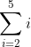
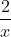
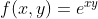
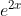
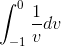
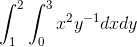

# 0x02. Calculus

## About

This is an educational project exploring concepts about **Calculus** towards a formation in Machine Learning.

## Table of contents

- [Requirements](#requirements)
  - [Installing Matplotlib 3.0](#installing-matplotlib-3)
  - [Dependencies](#dependencies)
- [Topics](#topics)
- [Read or watch](#read-or-watch)
- [Files](#files)

  - [0. Line Graph](#0-line-graph)
  - [1. Scatter](#1-satter)
  - [2. Change of scale](#2-change-of-scale)
  - [3. Two is better than one](#3-two-is-better-than-one)
  - [4. Frequency](#4-frequency)
  - [5. All in One](#5-all-in-one)
  - [6. Stacking Bars](#6-stacking-bars)
  - [7. Gradient](#7-gradient)
  - [8. PCA](#8-pca)

## Requirements

- Python 3.6.14

### Dependencies

Please refer at the [requirements.txt](../../requirements.txt) file at the root of this repository.

## Topics

- Summation and Product notation
- What is a series?
- Common series
- What is a derivative?
- What is the product rule?
- What is the chain rule?
- Common derivative rules
- What is a partial derivative?
- What is an indefinite integral?
- What is a definite integral?
- What is a double integral?

## Read or watch

Before start please read or watch this concepts.

- [Sigma Notation](https://www.youtube.com/watch?v=TjMLzklnn2c) (starting at 0:32)
- [Π Product Notation](https://www.youtube.com/watch?v=sP1-EQJKSgk) (up to 0:20)
- [Sigma and Pi Notation](https://mathmaine.com/2010/04/01/sigma-and-pi-notation/)
- [What is a Series?](https://virtualnerd.com/algebra-2/sequences-series/define/defining-series/series-definition)
- [What is a Mathematical Series?](https://www.quickanddirtytips.com/education/math/what-is-a-mathematical-series)
- [List of mathematical series: Sums of powers](https://en.wikipedia.org/wiki/List_of_mathematical_series#Sums_of_powers)
- [Bernoulli Numbers(Bn)](https://en.wikipedia.org/wiki/Bernoulli_number)
- [Bernoulli Polynomials(Bn(x))](https://en.wikipedia.org/wiki/Bernoulli_polynomials)
- [Derivative (mathematics)](https://simple.wikipedia.org/wiki/Derivative_%28mathematics%29)
- [Calculus for ML](https://ml-cheatsheet.readthedocs.io/en/latest/calculus.html)
- [1 of 2: Seeing the big picture](https://www.youtube.com/watch?v=tt2DGYOi3hc)
- [2 of 2: First Principles](https://www.youtube.com/watch?v=50Bda5VKbqA)
- [1 of 2: Finding the Derivative](https://www.youtube.com/watch?v=fXYhyyJpFe8)
- [2 of 2: What do we discover?](https://www.youtube.com/watch?v=Un0RcTMPJ64)
- [Deriving a Rule for Differentiating Powers of x](https://www.youtube.com/watch?v=I8IM9P-2TRU)
- [1 of 3: Introducing a substitution](https://www.youtube.com/watch?v=U0m4MsOgETw)
- [2 of 3: Combining derivatives](https://www.youtube.com/watch?v=z-tEsz0bSrA)
- [How To Understand Derivatives: The Product, Power & Chain Rules](https://betterexplained.com/articles/derivatives-product-power-chain/)
- [Product Rule](https://en.wikipedia.org/wiki/Product_rule)
- [Common Derivatives and Integrals](https://www.coastal.edu/media/academics/universitycollege/mathcenter/handouts/calculus/deranint.PDF)
- [Introduction to partial derivatives](https://mathinsight.org/partial_derivative_introduction)
- [Partial derivatives - How to solve?](https://www.youtube.com/watch?v=rnoToCoEK48)
- [Integral](https://en.wikipedia.org/wiki/Integral)
- [Integration and the fundamental theorem of calculus](https://www.youtube.com/watch?v=rfG8ce4nNh0)
- [Introduction to Integration](https://www.mathsisfun.com/calculus/integration-introduction.html)
- [Indefinite Integral - Basic Integration Rules, Problems, Formulas, Trig Functions, Calculus](https://www.youtube.com/watch?v=o75AqTInKDU)
- [Definite Integrals](https://www.mathsisfun.com/calculus/integration-definite.html)
- [Definite Integral](https://www.youtube.com/watch?v=Gc3QvUB0PkI)
- [Multiple integral](https://en.wikipedia.org/wiki/Multiple_integral)
- [Double integral 1](https://www.youtube.com/watch?v=85zGYB-34jQ)
- [Double integrals 2](https://www.youtube.com/watch?v=TdLD2Zh-nUQ)

**Extra**

- [Sumatoria - Notación Sigma (spanish content)](https://www.youtube.com/playlist?list=PLeySRPnY35dG324yAD99bbMeWMc1_2Kot)
- [Fórmulas y propiedades de notación sigma (spanish content)](https://www.youtube.com/watch?v=_rnI-32GT5I)
- [Productorio (spanish content)](https://www.youtube.com/watch?v=T81syGvpVPs)
- [Productoria y propiedades (spanish content)](https://www.youtube.com/watch?v=4QDuHUB6Uxg)
- [Productoria (spanish content)](https://ivanorozco.jimdofree.com/estad%C3%ADstica-1/sexto/productoria/)
- [Derivadas (spanish content)](https://www.youtube.com/playlist?list=PLeySRPnY35dG2UQ35tPsaVMYkQhc8Vp__)
- [Clasificación de polinomios (spanish content)](https://www.youtube.com/watch?v=vvIYwabU1lw&t=372s)
- [Integrales (spanish content)](https://www.youtube.com/playlist?list=PLeySRPnY35dEHnMLZGaNEXgHzJ2-TPLWw)

## Files

This project (lesson) is conceived to be carried out step by step, that is why the description of the files is presented as a statement.

_Some of the stataments are questions about calculus operations, the number of the correct answer is the one in the answer file_

### 0. Sigma is for Sum

**[0-sigma_is_for_sum](0-sigma_is_for_sum)**



1. 3 + 4 + 5
2. 3 + 4
3. 2 + 3 + 4 + 5
4. 2 + 3 + 4

### 1. The Greeks pronounce it sEEgma

**[1-seegma](1-seegma)**


1. 90 - 20
2. 36i - 20
3. 90 - 8k
4. 36i - 8k

### 2. Pi is for Product

**[2-pi_is_for_product](2-pi_is_for_product)**


1. (m - 1)!
2. 0
3. (m + 1)!
4. m!

### 3. The Greeks pronounce it pEE

**[3-pee](3-pee)**


1. 10!
2. 9!
3. 100
4. 0

### 4. Hello, derivatives!

**[4-hello_derivatives](4-hello_derivatives)**

 where 

1. 3x<sup>3</sup> + 6x<sup>2</sup> - 4
2. 4x<sup>3</sup> + 6x<sup>2</sup> - 5
3. 4x<sup>3</sup> + 9x<sup>2</sup> - 5
4. 4x<sup>3</sup> + 9x<sup>2</sup> - 4

### 5. A log on the fire

**[5-log_on_fire](5-log_on_fire)**


1. 
2. 
3. 
4. 

### 6. It is difficult to free fools from the chains they revere

**[6-voltaire](6-voltaire)**


1. 
2. 
3. 
4. 

### 7. Partial truths are often more insidious than total falsehoods

**[7-partial_truths](7-partial_truths)**

 where  and 

1. 
2. 
3. 
4. 

### 8. Put it all together and what do you get?

**[8-all-together](8-all-together)**

 where 

1. 
2. 
3. 
4. 

### 9. Our life is the sum total of all the decisions we make every day, and those decisions are determined by our priorities

**[9-sum_total.py](9-sum_total.py)**

Write a function `def summation_i_squared(n):` that calculates  :

- `n` is the stopping condition
- Return the integer value of the sum
- If `n` is not a valid number, return `None`
- You are not allowed to use any loops

```
alexa@ubuntu:0x02-calculus$ cat 9-main.py
#!/usr/bin/env python3

summation_i_squared = __import__('9-sum_total').summation_i_squared

n = 5
print(summation_i_squared(n))
alexa@ubuntu:0x02-calculus$ ./9-main.py
55
alexa@ubuntu:0x02-calculus$
```

### 10. Derive happiness in oneself from a good day's work

**[10-matisse.py](10-matisse.py)**

Write a function `def poly_derivative(poly):` that calculates the derivative of a polynomial:

- `poly` is a list of coefficients representing a polynomial
  - the index of the list represents the power of `x` that the coefficient belongs to
  - Example: if , `poly` is equal to `[5, 3, 0, 1]`
- If `poly` is not valid, return `None`
- If the derivative is `0`, return `[0]`
- Return a new list of coefficients representing the derivative of the polynomial

```
alexa@ubuntu:0x02-calculus$ cat 10-main.py
#!/usr/bin/env python3

poly_derivative = __import__('10-matisse').poly_derivative

poly = [5, 3, 0, 1]
print(poly_derivative(poly))
alexa@ubuntu:0x02-calculus$ ./10-main.py
[3, 0, 3]
alexa@ubuntu:0x02-calculus$
```

### 11. Good grooming is integral and impeccable style is a must

**[11-integral](11-integral)**


1. 3x<sup>2</sup> + C
2. x<sup>4</sup>/4 + C
3. x<sup>4</sup> + C
4. x<sup>4</sup>/3 + C

### 12. We are all an integral part of the web of life

**[12-integral](12-integral)**


1. e<sup>2y</sup> + C
2. e<sup>y</sup>+ C
3. e<sup>2y</sup>/2 + C
4. e<sup>y</sup>/2 + C

### 13. Create a definite plan for carrying out your desire and begin at once

**[13-definite](13-definite)**


1. 3
2. 6
3. 9
4. 27

### 14. My talents fall within definite limitations

**[14-definite](14-definite)**



1. -1
2. 0
3. 1
4. undefined

### 15. Winners are people with definite purpose in life

**[15-definite](15-definite)**


1. 5
2. 5x
3. 25
4. 25x

### 16. Double whammy

**[16-double](16-double)**



1. 9ln(2)
2. 9
3. 27ln(2)
4. 27

### 17. Integrate

**[17-integrate.py](17-integrate.py)**

Write a function `def poly_integral(poly, C=0):` that calculates the integral of a polynomial:

- `poly` is a list of coefficients representing a polynomial
  - the index of the list represents the power of `x` that the coefficient belongs to
  - Example: if , `poly` is equal to `[5, 3, 0, 1]`
- `C` is an integer representing the integration constant
- If a coefficient is a whole number, it should be represented as an integer
- If `poly` or `C` are not valid, return `None`
- Return a new list of coefficients representing the integral of the polynomial
- The returned list should be as small as possible

```
alexa@ubuntu:0x02-calculus$ cat 17-main.py
#!/usr/bin/env python3

poly_integral = __import__('17-integrate').poly_integral

poly = [5, 3, 0, 1]
print(poly_integral(poly))
alexa@ubuntu:0x02-calculus$ ./17-main.py
[0, 5, 1.5, 0, 0.25]
alexa@ubuntu:0x02-calculus$
```
