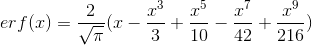

# 0x03. Probability

## About

This is an educational project exploring concepts about **Probability** towards a formation in Machine Learning.

## Table of contents

- [Requirements](#requirements)
  - [Dependencies](#dependencies)
- [Topics](#topics)
- [Read or watch](#read-or-watch)
- [Files](#files)
  - [0. Initialize Poisson](#0-initialize-poisson)
  - [1. Poisson PMF](#1-poisson-pmf)
  - [2. Poisson CDF](#2-poisson-cdf)
  - [3. Initialize Exponential](#3-initialize-exponential)
  - [4. Exponential PDF](#4-exponential-pdf)
  - [5. Exponential CDF](#5-exponential-cdf)
  - [6. Initialize Normal](#6-initialize-normal)
  - [7. Normalize Normal](#7-normalize-normal)
  - [8. Normal PDF](#8-normal-pdf)
  - [9. Normal CDF](#9-normal-cdf)
  - [10. Initialize Binomial](#10-initialize-binomial)
  - [11. Binomial PMF](#11-binomial-pmf)
  - [12. Binomial CDF](#12-binomial-cdf)

## Requirements

- Python 3.6.14

### Dependencies

Please refer at the [requirements.txt](../../requirements.txt) file at the root of this repository.

## Topics

- What is probability?
- Basic probability notation
- What is independence? What is disjoint?
- What is a union? intersection?
- What are the general addition and multiplication rules?
- What is a probability distribution?
- What is a probability distribution function? probability mass function?
- What is a cumulative distribution function?
- What is a percentile?
- What is mean, standard deviation, and variance?
- Common probability distributions

## Read or watch

Before start please read or watch this concepts.

- [Probability](https://en.wikipedia.org/wiki/Probability)
- [Basic Concepts](https://onlinestatbook.com/2/probability/basic.html)
- [Intro to probability 1: Basic notation](https://www.youtube.com/watch?v=TkU3BvDAOtQ)
- [Intro to probability 2: Independent and disjoint](https://www.youtube.com/watch?v=GnWHt9nqwBA)
- [Intro to Probability 3: General Addition Rule; Union; OR](https://www.youtube.com/watch?v=TyAaVGR4MrA)
- [Intro to Probability 4: General multiplication rule; Intersection; AND](https://www.youtube.com/watch?v=wB-ZG9bgPXY)
- [Permutations and Combinations](https://onlinestatbook.com/2/probability/permutations.html)
- [Probability distribution](https://en.wikipedia.org/wiki/Probability_distribution)
- [Probability Theory](https://intranet.hbtn.io/rltoken/n9XfTIJ16hSMNpIdMS-WmA)
- [Cumulative Distribution Functions](https://www.oreilly.com/library/view/think-stats-2nd/9781491907344/ch04.html)
- [Common Probability Distributions: The Data Scientist’s Crib Sheet](https://medium.com/@srowen/common-probability-distributions-347e6b945ce4)
- [NORMAL MODEL PART 1 — EMPIRICAL RULE](https://www.youtube.com/watch?v=xgolpGrAZWo&list=PLFGZup_HuWTtIs0Xbzt7vDoFrnZxN4VXT&index=22)
- [Normal Distribution](https://www.mathsisfun.com/data/standard-normal-distribution.html)
- [Variance](https://en.wikipedia.org/wiki/Variance)
- [Variance (Concept)](https://www.youtube.com/watch?v=2eP14USYwtg)
- [Binomial Distribution](https://onlinestatbook.com/2/probability/binomial.html)
- [Poisson Distribution](https://onlinestatbook.com/2/probability/poisson.html)
- [Hypergeometric Distribution](https://onlinestatbook.com/2/probability/hypergeometric.html)

**As references**

- [numpy.random.poisson](https://docs.scipy.org/doc/numpy-1.14.0/reference/generated/numpy.random.poisson.html)
- [numpy.random.exponential](https://docs.scipy.org/doc/numpy-1.14.0/reference/generated/numpy.random.exponential.html)
- [numpy.random.normal](https://docs.scipy.org/doc/numpy-1.14.0/reference/generated/numpy.random.normal.html)
- [numpy.random.binomial](https://docs.scipy.org/doc/numpy-1.14.0/reference/generated/numpy.random.binomial.html)
- [erf](https://mathworld.wolfram.com/Erf.html)

**Extra**

_Matemóvil (youtube channel)_

- [Estadística | Introducción a la Estadística](https://www.youtube.com/watch?v=gl9EEbT7viM&list=PL3KGq8pH1bFTdYhAMbC0XHRpe_njRSctM) (spanish content)
- [Estadística | Variables estadísticas](https://www.youtube.com/watch?v=Tb3sgUSd2SQ&list=PL3KGq8pH1bFSLAzS3dccWo7Lgucaj09Km) (spanish content)
- [Estadística | Tabla de frecuencias](https://www.youtube.com/watch?v=iPEt789ewVM&list=PL3KGq8pH1bFSVLbLye45H3w1vzIQ0rDCi) (spanish content)
- [Estadística | Gráficas estadísticas](https://www.youtube.com/watch?v=L2F2VkzsZwU&list=PL3KGq8pH1bFRRxYgLYqS7_BIR2QyjdcPT) (spanish content)
- [Estadística | Media, Mediana y Moda](https://www.youtube.com/watch?v=jiceVfALmV0&list=PL3KGq8pH1bFQenma5Ofy1bmr0yJQlNZWX) (spanish content)
- [Estadística | Técnicas de conteo: principio de adición y multiplicación (suma y producto)](https://www.youtube.com/watch?v=BeA6saiK-_8&list=PL3KGq8pH1bFSVoVsMfKPenEiSKtfDNv4K) (spanish content)
- [Estadística | Análisis combinatorio: permutaciones y combinador](https://www.youtube.com/watch?v=QXO3u6Ak4rU&list=PL3KGq8pH1bFTkIi5Xbs9Ul9f05JZrxrzV) (spanish content)
- [Estadística | Variaciones, Combianciones y Permutaciones](https://www.youtube.com/watch?v=ynxsVxVZ9Vw&list=PL3KGq8pH1bFQ3tbm4wxhfZpUVtcPZXqG3) (spanish content)
- [Estadística | Distribución normal](https://www.youtube.com/watch?v=T7_ktqfVseU&list=PL3KGq8pH1bFQrSms9uTOpPk0euoHnx7mK) (spanish content)
- [Estadística | Probabilidades](https://www.youtube.com/watch?v=0lxZMaoeUno&list=PL3KGq8pH1bFQ5ZdTbz7DRXMDWv_wFvE1K) (spanish content)
- [Distribución de Poisson | Intro](https://www.youtube.com/watch?v=PMX75m4-s9A&pp=sAQA) (spanish content)
- [Distribución de Poisson | Ejercicio 1](https://www.youtube.com/watch?v=x9jF11I5x-g&pp=sAQA) (spanish content)
- [Distribución de Poisson | Ejercicio 2](https://www.youtube.com/watch?v=MbevsnWYb5o&pp=sAQA) (spanish content)
- [Distribución de Bernoulli | Intro](https://www.youtube.com/watch?v=olGbPzIGJ4M&t=219s) (spanish content)
- [Media (valor esperado) y varianza de una variable aleatoria de Bernoulli](https://www.youtube.com/watch?v=qWpV4TQRk9I) (spanish content)
- [Variables aleatorias discretas y continuas](https://www.youtube.com/watch?v=_wonmKS4Blk) (spanish content)
- [Función de distribución acumulativa de una variable aleatoria discreta](https://www.youtube.com/watch?v=OftL6S127wc) (spanish content)

_Matemáticas profe Alex (youtube channel)_

- [Estadística | Conceptos básicos](https://www.youtube.com/watch?v=Xq3thcQqwbc&list=PLeySRPnY35dFF5D9g_zi07yPKGXui4GII) (spanish content)
- [Estadística | Tabla de frecuencias](https://www.youtube.com/watch?v=a4cI02iW_zQ&list=PLeySRPnY35dFcEmQDGrPxwJVXiIeu_9cl) (spanish content)
- [Estadística | Media, mediana y moda](https://www.youtube.com/watch?v=fOuRqk1nzgY&list=PLeySRPnY35dFkzBgleLJ5WVFbGdkmCik5) (spanish content)
- [Estadística | Cuartiles, Deciles y Percentiles](https://www.youtube.com/watch?v=suSz9RXFNTs&list=PLeySRPnY35dG_Wo7ngNsT60lvahhW8UQy) (spanish content)
- [Estadística | Varianza y desviación](https://www.youtube.com/watch?v=hLmsEFNaOgY&list=PLeySRPnY35dE25b7mIEUlsMCQqlhJFhyG) (spanish content)
- [Estadística | Combianciones, Permutaciones y Variaciones](https://www.youtube.com/watch?v=ec8TQjfQrGY&list=PLeySRPnY35dFF_kWyWL893posL7DNlFHa) (spanish content)
- [Estadística | Probabilidad](https://www.youtube.com/watch?v=tQh29_Noo9w&list=PLeySRPnY35dEtzvR4hUhigwTCHQcxP28l) (spanish content)

_Other_

- [Distribuciones de Probabilidad (Discreta y Continua)](https://www.youtube.com/watch?v=NFfpUbGlm_c) (spanish content)
- [Distribucion Normal Estandarizada](https://www.youtube.com/watch?v=_gyrWRyh6Qg) (spanish content)
- [The Poisson Distribution and Poisson Process Explained](https://towardsdatascience.com/the-poisson-distribution-and-poisson-process-explained-4e2cb17d459)
- [Gallery of Distributions](https://www.itl.nist.gov/div898/handbook/eda/section3/eda366.htm)

## Files

This project (lesson) is conceived to be carried out step by step, that is why the description of the files is presented as a statement.

### Mathematical Approximations

For the following tasks, you will have to use various irrational numbers and functions. Since you are not able to import any libraries, please use the following approximations:

- π = 3.1415926536
- e = 2.7182818285
- 

### 0. Initialize Poisson

**[poisson.py](poisson.py)**

Create a class `Poisson` that represents a poisson distribution:

- Class contructor `def __init__(self, data=None, lambtha=1.):`
  - `data` is a list of the data to be used to estimate the distribution
  - `lambtha` is the expected number of occurences in a given time frame
  - Sets the instance attribute lambtha
    - Saves `lambtha` as a float
  - If `data` is not given, (i.e. `None` (be careful: `not data` has not the same result as `data is None`)):
    - Use the given `lambtha`
    - If `lambtha` is not a positive value or equals to 0, raise a `ValueError` with the message `lambtha must be a positive value`
  - If `data` is given:
    - Calculate the `lambtha` of `data`
    - If `data` is not a `list`, raise a `TypeError` with the message `data must be a list`
    - If `data` does not contain at least two data points, raise a `ValueError` with the message `data must contain multiple values`

```
alexa@ubuntu-xenial:0x03-probability$ cat 0-main.py
#!/usr/bin/env python3

import numpy as np
Poisson = __import__('poisson').Poisson

np.random.seed(0)
data = np.random.poisson(5., 100).tolist()
p1 = Poisson(data)
print('Lambtha:', p1.lambtha)

p2 = Poisson(lambtha=5)
print('Lambtha:', p2.lambtha)
alexa@ubuntu-xenial:0x03-probability$ ./0-main.py
Lambtha: 4.84
Lambtha: 5.0
alexa@ubuntu-xenial:0x03-probability$
```

### 1. Poisson PMF

**[poisson.py](poisson.py)**

Update the class `Poisson`:

- Instance method `def pmf(self, k):`
  - Calculates the value of the PMF for a given number of “successes”
  - `k` is the number of “successes”
    - If `k` is not an integer, convert it to an integer
    - If `k` is out of range, return `0`
  - Returns the PMF value for `k`

```
alexa@ubuntu-xenial:0x03-probability$ cat 1-main.py
#!/usr/bin/env python3

import numpy as np
Poisson = __import__('poisson').Poisson

np.random.seed(0)
data = np.random.poisson(5., 100).tolist()
p1 = Poisson(data)
print('P(9):', p1.pmf(9))

p2 = Poisson(lambtha=5)
print('P(9):', p2.pmf(9))
alexa@ubuntu-xenial:0x03-probability$ ./1-main.py
P(9): 0.03175849616802446
P(9): 0.036265577412911795
alexa@ubuntu-xenial:0x03-probability$
```

### 2. Poisson CDF

**[poisson.py](poisson.py)**

Update the class `Poisson`:

- Instance method `def cdf(self, k):`
  - Calculates the value of the CDF for a given number of “successes”
  - `k` is the number of “successes”
    - If `k` is not an integer, convert it to an integer
    - If `k` is out of range, return `0`
  - Returns the CDF value for `k`

```
alexa@ubuntu-xenial:0x03-probability$ cat 2-main.py
#!/usr/bin/env python3

import numpy as np
Poisson = __import__('poisson').Poisson

np.random.seed(0)
data = np.random.poisson(5., 100).tolist()
p1 = Poisson(data)
print('F(9):', p1.cdf(9))

p2 = Poisson(lambtha=5)
print('F(9):', p2.cdf(9))
alexa@ubuntu-xenial:0x03-probability$ ./2-main.py
F(9): 0.9736102067423525
F(9): 0.9681719426208609
alexa@ubuntu-xenial:0x03-probability$
```

### 3. Initialize Exponential

**[exponential.py](exponential.py)**

Create a class `Exponential` that represents an exponential distribution:

- Class contructor `def __init__(self, data=None, lambtha=1.):`
  - `data` is a list of the data to be used to estimate the distribution
  - `lambtha` is the expected number of occurences in a given time frame
  - Sets the instance attribute `lambtha`
    - Saves `lambtha` as a float
  - If `data` is not given (i.e. `None`):
    - Use the given `lambtha`
    - If `lambtha` is not a positive value, raise a `ValueError` with the message `lambtha must be a positive value`
  - If `data` is given:
    - Calculate the `lambtha` of `data`
    - If `data` is not a `list`, raise a `TypeError` with the message `data must be a list`
    - If `data` does not contain at least two data points, raise a `ValueError` with the message `data must contain multiple values`

```
alexa@ubuntu-xenial:0x03-probability$ cat 3-main.py
#!/usr/bin/env python3

import numpy as np
Exponential = __import__('exponential').Exponential

np.random.seed(0)
data = np.random.exponential(0.5, 100).tolist()
e1 = Exponential(data)
print('Lambtha:', e1.lambtha)

e2 = Exponential(lambtha=2)
print('Lambtha:', e2.lambtha)
alexa@ubuntu-xenial:0x03-probability$ ./3-main.py
Lambtha: 2.1771114730906937
Lambtha: 2.0
alexa@ubuntu-xenial:0x03-probability$
```

### 4. Exponential PDF

**[exponential.py](exponential.py)**

Update the class `Exponential`:

- Instance method `def pdf(self, x):`
  - Calculates the value of the PDF for a given time period
  - `x` is the time period
  - Returns the PDF value for `x`
  - If `x` is out of range, return `0`

```
alexa@ubuntu-xenial:0x03-probability$ cat 4-main.py
#!/usr/bin/env python3

import numpy as np
Exponential = __import__('exponential').Exponential

np.random.seed(0)
data = np.random.exponential(0.5, 100).tolist()
e1 = Exponential(data)
print('f(1):', e1.pdf(1))

e2 = Exponential(lambtha=2)
print('f(1):', e2.pdf(1))
alexa@ubuntu-xenial:0x03-probability$ ./4-main.py
f(1): 0.24681591903431568
f(1): 0.2706705664650693
alexa@ubuntu-xenial:0x03-probability$
```

### 5. Exponential CDF

**[exponential.py](exponential.py)**

Update the class `Exponential`:

- Instance method `def cdf(self, x):`
  - Calculates the value of the CDF for a given time period
  - `x` is the time period
  - Returns the CDF value for `x`
  - If `x` is out of range, return `0`

```
alexa@ubuntu-xenial:0x03-probability$ cat 5-main.py
#!/usr/bin/env python3

import numpy as np
Exponential = __import__('exponential').Exponential

np.random.seed(0)
data = np.random.exponential(0.5, 100).tolist()
e1 = Exponential(data)
print('F(1):', e1.cdf(1))

e2 = Exponential(lambtha=2)
print('F(1):', e2.cdf(1))
alexa@ubuntu-xenial:0x03-probability$ ./5-main.py
F(1): 0.886631473819791
F(1): 0.8646647167674654
alexa@ubuntu-xenial:0x03-probability$
```

### 6. Initialize Normal

**[normal.py](normal.py)**

Create a class `Normal` that represents a normal distribution:

- Class contructor `def __init__(self, data=None, mean=0., stddev=1.):`
  - `data` is a list of the data to be used to estimate the distribution
  - `mean` is the mean of the distribution
  - `stddev` is the standard deviation of the distribution
  - Sets the instance attributes `mean` and `stddev`
    - Saves `mean` and `stddev` as floats
  - If `data` is not given (i.e. `None` (be careful: `not data` has not the same result as `data is None`))
    - Use the given `mean` and `stddev`
    - If `stddev` is not a positive value or equals to 0, raise a `ValueError` with the message stddev` must be a positive value`
  - If `data` is given:
    - Calculate the mean and standard deviation of `data`
    - If `data` is not a `list`, raise a `TypeError` with the message `data must be a list`
    - If `data` does not contain at least two data points, raise a `ValueError` with the message `data must contain multiple values`

```
alexa@ubuntu-xenial:0x03-probability$ cat 6-main.py
#!/usr/bin/env python3

import numpy as np
Normal = __import__('normal').Normal

np.random.seed(0)
data = np.random.normal(70, 10, 100).tolist()
n1 = Normal(data)
print('Mean:', n1.mean, ', Stddev:', n1.stddev)

n2 = Normal(mean=70, stddev=10)
print('Mean:', n2.mean, ', Stddev:', n2.stddev)
alexa@ubuntu-xenial:0x03-probability$ ./6-main.py
Mean: 70.59808015534485 , Stddev: 10.078822447165797
Mean: 70.0 , Stddev: 10.0
alexa@ubuntu-xenial:0x03-probability$
```

### 7. Normalize Normal

**[normal.py](normal.py)**

Update the class `Normal`:

- Instance method `def z_score(self, x):`
  - Calculates the z-score of a given x-value
  - `x` is the x-value
  - Returns the z-score of `x`
  - Instance method `def x_value(self, z):`
    - Calculates the x-value of a given z-score
    - `z` is the z-score
    - Returns the x-value of `z`

```
alexa@ubuntu-xenial:0x03-probability$ cat 7-main.py
#!/usr/bin/env python3

import numpy as np
Normal = __import__('normal').Normal

np.random.seed(0)
data = np.random.normal(70, 10, 100).tolist()
n1 = Normal(data)
print('Z(90):', n1.z_score(90))
print('X(2):', n1.x_value(2))

n2 = Normal(mean=70, stddev=10)
print()
print('Z(90):', n2.z_score(90))
print('X(2):', n2.x_value(2))
alexa@ubuntu-xenial:0x03-probability$ ./7-main.py
Z(90): 1.9250185174272068
X(2): 90.75572504967644

Z(90): 2.0
X(2): 90.0
alexa@ubuntu-xenial:0x03-probability$
```

### 8. Normal PDF

**[normal.py](normal.py)**

Update the class `Normal`:

- Instance method `def pdf(self, x):`
  - Calculates the value of the PDF for a given x-value
  - `x` is the x-value
  - Returns the PDF value for `x`

```
alexa@ubuntu-xenial:0x03-probability$ cat 8-main.py
#!/usr/bin/env python3

import numpy as np
Normal = __import__('normal').Normal

np.random.seed(0)
data = np.random.normal(70, 10, 100).tolist()
n1 = Normal(data)
print('PSI(90):', n1.pdf(90))

n2 = Normal(mean=70, stddev=10)
print('PSI(90):', n2.pdf(90))
alexa@ubuntu-xenial:0x03-probability$ ./8-main.py
PSI(90): 0.006206096804434349
PSI(90): 0.005399096651147344
alexa@ubuntu-xenial:0x03-probability$
```

### 9. Normal CDF

**[normal.py](normal.py)**

Update the class `Normal`:

- Instance method `def cdf(self, x):`
  - Calculates the value of the CDF for a given x-value
  - `x` is the x-value
  - Returns the CDF value for `x`

```
alexa@ubuntu-xenial:0x03-probability$ cat 9-main.py
#!/usr/bin/env python3

import numpy as np
Normal = __import__('normal').Normal

np.random.seed(0)
data = np.random.normal(70, 10, 100).tolist()
n1 = Normal(data)
print('PHI(90):', n1.cdf(90))

n2 = Normal(mean=70, stddev=10)
print('PHI(90):', n2.cdf(90))
alexa@ubuntu-xenial:0x03-probability$ ./9-main.py
PHI(90): 0.982902011086006
PHI(90): 0.9922398930667251
alexa@ubuntu-xenial:0x03-probability$
```

### 10. Initialize Binomial

**[binomial.py](binomial.py)**

Create a class `Binomial` that represents a binomial distribution:

- Class contructor `def __init__(self, data=None, n=1, p=0.5):`
  - `data` is a list of the data to be used to estimate the distribution
  - `n` is the number of Bernoulli trials
  - `p` is the probability of a “success”
  - Sets the instance attributes `n` and `p`
    - Saves `n` as an integer and `p` as a float
  - If `data` is not given (i.e. `None`)
    - Use the given `n` and `p`
    - If `n` is not a positive value, raise a `ValueError` with the message `n must be a positive value`
    - If `p` is not a valid probability, raise a `ValueError` with the message `p must be greater than 0 and less than 1`
  - If `data` is given:
    - Calculate `n` and `p` from data
    - Round `n` to the nearest integer (rounded, not casting! The difference is important: `int(3.7)` is not the same as `round(3.7)`)
    - Hint: Calculate `p` first and then calculate `n`. Then recalculate `p`. Think about why you would want to do it this way?
    - If `data` is not a `list`, raise a `TypeError` with the message `data must be a list`
    - If `data` does not contain at least two data points, raise a `ValueError` with the message `data must contain multiple values`

```
alexa@ubuntu-xenial:0x03-probability$ cat 10-main.py
#!/usr/bin/env python3

import numpy as np
Binomial = __import__('binomial').Binomial

np.random.seed(0)
data = np.random.binomial(50, 0.6, 100).tolist()
b1 = Binomial(data)
print('n:', b1.n, "p:", b1.p)

b2 = Binomial(n=50, p=0.6)
print('n:', b2.n, "p:", b2.p)
alexa@ubuntu-xenial:0x03-probability$ ./10-main.py
n: 50 p: 0.606
n: 50 p: 0.6
alexa@ubuntu-xenial:0x03-probability$
```

### 11. Binomial PMF

**[binomial.py](binomial.py)**

Update the class `Binomial`:

- Instance method `def pmf(self, k):`
  - Calculates the value of the PMF for a given number of “successes”
  - `k` is the number of “successes”
    - If `k` is not an integer, convert it to an integer
    - If `k` is out of range, return `0`
  - Returns the PMF value for `k`

```
alexa@ubuntu-xenial:0x03-probability$ cat 11-main.py
#!/usr/bin/env python3

import numpy as np
Binomial = __import__('binomial').Binomial

np.random.seed(0)
data = np.random.binomial(50, 0.6, 100).tolist()
b1 = Binomial(data)
print('P(30):', b1.pmf(30))

b2 = Binomial(n=50, p=0.6)
print('P(30):', b2.pmf(30))
alexa@ubuntu-xenial:0x03-probability$ ./11-main.py
P(30): 0.11412829839570347
P(30): 0.114558552829524
alexa@ubuntu-xenial:0x03-probability$
```

### 12. Binomial CDF

**[binomial.py](binomial.py)**

Update the class `Binomial`:

- Instance method `def cdf(self, k):`
  - Calculates the value of the CDF for a given number of “successes”
  - `k` is the number of “successes”
    - If `k` is not an integer, convert it to an integer
    - If `k` is out of range, return `0`
  - Returns the CDF value for `k`
  - Hint: use the `pmf` method

```
alexa@ubuntu-xenial:0x03-probability$ cat 12-main.py
#!/usr/bin/env python3

import numpy as np
Binomial = __import__('binomial').Binomial

np.random.seed(0)
data = np.random.binomial(50, 0.6, 100).tolist()
b1 = Binomial(data)
print('F(30):', b1.cdf(30))

b2 = Binomial(n=50, p=0.6)
print('F(30):', b2.cdf(30))
alexa@ubuntu-xenial:0x03-probability$ ./12-main.py
F(30): 0.5189392017296368
F(30): 0.5535236207894576
alexa@ubuntu-xenial:0x03-probability$
```
